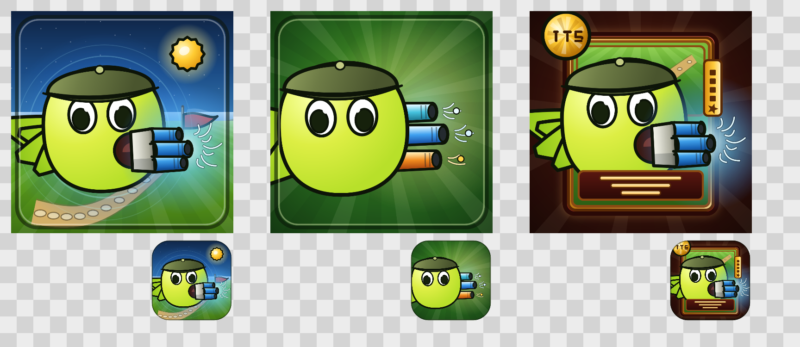

# PvZ-Portable 改版图标（3 个方案）

为 `feat/mod` 这条改版线设计的图标稿。三个方案都按**原版 PvZ 的卡通画法**绘制：粗黑描边、平涂高饱和、卡面包边，
配色直接取自游戏自己的贴图（豌豆头 `#DDFF33`、机枪头盔 `#6E7C46`、机枪枪管银灰 `#DDDDD2`、阳光 `#FFCC33`），
所以放在游戏旁边不违和。



## 方案 A —— `a-journey`：究极射手 × 11 轮旅程

**要讲的事**：这个改版最核心的两样东西——**旅行模式**和**究极植物**。

- 主体：**究极电能机枪射手**（机枪头盔 + 四段枪管，枪管按 `ELECTRIC_BLUE` 上色，枪口带电弧）
- 背景：夜色草坪 + 一条**蜿蜒的旅行小路**，路上 11 颗踏脚石 = **11 轮路线**，终点插**红旗**
- 右上：**阳光币**（PvZ 的通用符号）

一眼能读出的信息量最大，适合当**主图标 / README 头图**。

| 文件 | 用途 |
| --- | --- |
| `a-journey-1024.png` | 方形满幅（含圆角内框），1024×1024 |
| `a-journey-appicon-1024.png` | iOS 圆角方形 + 透明背景，可直接当应用图标 |

## 方案 B —— `b-elements`：一株三管（电 / 冰 / 火）

**要讲的事**：这个改版把机枪射手变成了一整个家族。

一株机枪射手、**三根枪管各一种属性**：上冰蓝、中电能蓝、下火焰橙，每根枪口喷出对应颜色的火花。
对应改版里的 **究极电能机枪射手**、**寒冰机枪射手**、**火焰机枪射手**（以及三线机枪射手）。

剪影最干净，**32px 下也能辨认**，适合当**应用图标**或者和 A 搭配使用。

| 文件 | 用途 |
| --- | --- |
| `b-elements-1024.png` | 方形满幅，1024×1024 |
| `b-elements-appicon-1024.png` | iOS 圆角方形 + 透明背景 |

## 方案 C —— `c-redcard`：旅行红卡

**要讲的事**：这个改版最直观的"新东西"——**旅行红卡**。

照游戏内**种子卡包**的样式做：红卡包体 + 金边 + 卡面窗口（里面是旅行小路），
左上角阳光币写 **175**（火豌豆射手定价），右侧**金色 RARE 条**，下方名牌位。

最"像游戏里的东西"，适合当**封面 / 视频封面 / 商店图**。

| 文件 | 用途 |
| --- | --- |
| `c-redcard-1024.png` | 方形满幅，1024×1024 |
| `c-redcard-appicon-1024.png` | iOS 圆角方形 + 透明背景 |

## 三个方案怎么选

| | 信息量 | 小尺寸辨识 | 最像原版游戏 | 建议用途 |
| --- | --- | --- | --- | --- |
| A 旅程 | ★★★ | ★★ | ★★ | 主图标、README 头图 |
| B 三属性 | ★★ | ★★★ | ★★ | 应用图标（小尺寸首选） |
| C 红卡 | ★★★ | ★★ | ★★★ | 封面图、宣传图 |

## 重新生成 / 改参数

图标是**代码画出来的矢量式光栅图**，不是手绘位图，所以想改配色、比例、位置直接改常量重跑即可。

```bash
cd tools/icons
npm install            # 只需 @napi-rs/canvas
node build.js          # 重新导出 docs/icons/*.png
node make-preview.js   # 重新生成 preview.png
```

- `tools/icons/lib.js` —— 绘图工具（描边平涂、渐变、叶片/枪管的锥形笔触）
- `tools/icons/head.js` —— **豌豆射手头部渲染器**，`VARIANTS` 里改配色，`drawHead(ctx, size, spec)` 复用
- `tools/icons/A-scene.js` / `B-fusion.js` / `C-redcard.js` —— 三个方案的构图
- `tools/icons/export.js` —— 导出圆角方形（iOS 图标网格：圆角半径 ≈ 边长 22.37%）+ 透明背景版本
- `tools/icons/build.js` —— 一次性导出全部 6 张图

> 注：`tools/icons/` 里没有游戏贴图，全部图形都是代码绘制的几何形状，因此可以安全入库
> （符合 `AGENTS.md` 的"仓库不含受版权保护的游戏素材"）。配色值是照着游戏贴图**采样**出来的。

---

# 应用图标（项目实际使用的那个）

仓库里**真正作为应用图标**使用的是根目录 `icon1.png`（手绘源图），由
`tools/icons/make-app-icon.js` 统一裁边、居中、缩放后分发到各平台。

## 源图

| 文件 | 说明 |
| --- | --- |
| `icon1.png` | **唯一需要改的源图**。任意尺寸的 RGBA PNG，可以带透明边距（脚本会自动裁掉） |
| `docs/icons/icon1-source-original.png` | 最初上传的原始备份（文件名里带空格的那版），仅作留底 |

脚本做的事：**找 alpha 包围盒 → 裁掉四周空白 → 按内容等比缩放 → 居中放到正方形画布上，四周留 8% 安全边距**。
所以换一张画得偏小或偏一边的图也不用手动调，直接重跑即可。

## 生成物

| 输出 | 平台 / 用途 |
| --- | --- |
| `icon.png`（根目录） | 通用图标（1024×1024，带透明），Linux `PKGBUILD` 安装为 `/usr/share/pixmaps/...` |
| `icon.ico`（根目录） | **Windows** 可执行文件图标（`LawnProject.rc` → `APP_ICON_PATH`），含 16/24/32/48/64/128/256 七档（≥128 用 PNG 压缩，小尺寸用 32bpp BMP + AND 掩码，保证老工具链也能读） |
| `android/app/src/main/res/mipmap-*/ic_launcher.png` | **Android** 启动图标，mdpi 48 / hdpi 72 / xhdpi 96 / xxhdpi 144 / xxxhdpi 192 |
| `ios/Assets.xcassets/AppIcon.appiconset/AppIcon.png` | **iOS** 应用图标，1024×1024，**已去 alpha**（iOS 不允许图标带透明通道） |
| `archlinux/icons/<尺寸>/io.github.wszqkzqk.pvz-portable.png` | **Linux** hicolor 主题图标，16/32/48/64/128/256/512，由 `archlinux/PKGBUILD` 与 `PKGBUILD-AUR` 安装到 `/usr/share/icons/hicolor/`，对应 `.desktop` 里的 `Icon=io.github.wszqkzqk.pvz-portable` |

## 换图标

1. 用新图覆盖根目录 `icon1.png`
2. 重跑：

```bash
cd tools/icons
node make-app-icon.js     # 重新分发到全部平台
node check-appicon.js     # 生成 docs/icons/appicon-check.png 核对各尺寸效果
```

`check-appicon.js` 会输出一张对照图：主图、真实降采样阶梯（128/64/48/32/16）、**从 `icon.ico` 里解析出来的每一帧**、
以及 Android / iOS / Linux 的成品，用来确认小尺寸下不会糊掉。

## 没接线的部分

- **运行时窗口图标**：除 Windows（走 `.exe` 资源）外，SDL 窗口目前没有调用 `SDL_SetWindowIcon`
  （`src/SexyAppFramework/platform/default/Window.cpp` 只设了 Wayland 的 `SDL_HINT_APP_ID`）。
  Linux 桌面启动器显示的是上面的 hicolor 图标，但窗口本身/taskbar 的图标在部分桌面环境下会是默认值。
  要补的话需要在 `MakeWindow()` 里加载并设置窗口图标。
- **Switch / 3DS**：仍用原来的 `icon-switch.jpg`、`icon-3ds.png`，本次未替换。
- `icon-readme.png`（README 顶部横图）和 `icon-3ds.png`、`icon-switch.jpg` 都保持原样。

