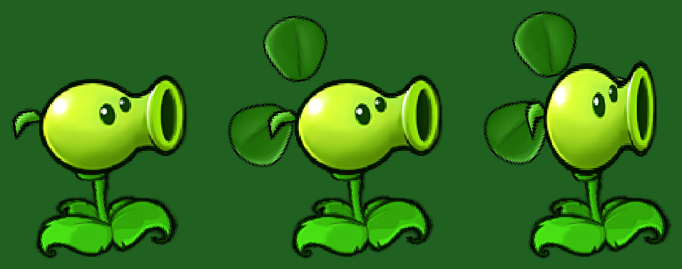

# 风神豌豆射手（Wind Peashooter）移植记录

**范围：** 本模组新增的原创植物：普通豌豆射手的贴图 + 三叶草的叶子，发射 40 伤害的风神豌豆并击退僵尸。  
**入口：** 旅行专属**红卡**（`gTravelPlantDefs` → 选卡器页 1 第 8 格、冰面沙盒旅行页、图鉴植物页第 2 页），
斗蛐蛐 1 的植物池自动收录（池子是遍历 `SeedType` 全量收集的）。

## 1. 数值与行为口径

| 项目 | 实现 |
| --- | --- |
| 阳光 / 卡片冷却 | 200 / `mRefreshTime = 750`（7.5 秒） |
| 生命 / 卡片冷却分级 | 300（沿用引擎默认）/ 短冷却（图鉴显示 `[WAIT_TIME_SHORT]`） |
| 出弹节奏 | 与豌豆射手完全一致：`mLaunchRate = 75`，实际 `75 - Rand(15)` 帧 |
| 弹丸 | `PROJECTILE_WIND_PEA`：单体直飞，**40 点**伤害 |
| 击退 | 命中时 `Zombie::KnockBack(WIND_PEA_KNOCKBACK = 20)`（像素，+X = 远离植物） |
| 免疫 | 冰车/投石车、空中阶段（撑杆跳/海豚/气球/蹦极/小鬼被扔/潜水入场）、愤怒的读报僵尸 —— 全部沿用 `Zombie::KnockBack` 自己那一份 |
| 不做的 | **首发大豌豆**（豌豆射手那发 300 伤害 / 2 倍体型）；**精英形态**（20% 淡蓝 + 波浪弹道，只属于豌豆射手/双发射手）；不会被火炬树桩点燃；没有升级/合成路径 |
| 外观 | `reanim/WindPeashooter.reanim` = `PeaShooterSingle.reanim` 的副本 + 三条三叶草叶片轨道 |

击退量的选法：普通僵尸行走速度 `mVelX ∈ [0.23, 0.37]` 像素/帧（23~37 像素/秒），
而风神豌豆 60~75 帧一发 —— 20 像素/发 ≈ 27~33 像素/秒，正好把一只普通僵尸大致顶在原地
（跑得快的那一档仍会缓慢逼近）。这是这只植物的定义特征，调手感只改
`src/GameConstants.h` 的 `WIND_PEA_KNOCKBACK` 一个数。

"其余机制同豌豆射手"包括：同一套索敌/伤害掩码/护盾结算、同一套 `anim_shooting` 收招、
同一套卡面缩放与出膛点（`GetPeaHeadOffset()`）。
**明确不做的两件事**：首发大豌豆（`mHasFiredFirstPea`）与**精英形态**（`mIsElite` 的名单里
没有它）—— 每一发都是同样的 40 伤害风神豌豆 + 击退，不会掷出波浪弹道的精英个体。
两件事在 `scripts/check-wind-peashooter.ps1` 里都有防回归断言。

## 2. 外观：豌豆射手 + 三叶草

贴图不新画任何 PNG：三叶草用的是**原版三叶草风扇（Blover）的叶片**
`IMAGE_REANIM_BLOVER_PETAL`（`reanim/Blover_petal.png`，33×34）。生成器
`scripts/gen-wind-peashooter-reanim.py`：

1. 读取 `reanim/PeaShooterSingle.reanim`（**正是** `REANIM_PEASHOOTER` 用的那个文件，
   也就是游戏里"普通豌豆射手"的样子）并原样保留全部 17 条轨道；
2. 读取 `reanim/Blover.reanim`，取 `Blover_petals / Blover_petals2 / Blover_petals3`
   **第 0 帧**的三片叶子几何（旋转 0° / 240° / 120°，正好围成一株三叶草），
   以三片叶子绘制中心的重心作为"三叶草中心"；
3. 追加三条轨道 `WindPeashooter_clover1/2/3`，插在 `anim_sprout` **之前**：
   整体等比缩放 `CLOVER_SCALE = 0.68`、整体旋转 `CLOVER_ROTATION = 0`，
   再把三叶草中心放到豌豆射手自己那支小叶子（`anim_sprout`）的中心加偏移
   `(+7, -8)` 处，并**逐帧跟随该轨道的 x/y 与倾角**；
   （X 一开始是 `+1`，实机反馈"三片叶子离脑袋太远、像飘在旁边"后调到 `+7`：
   上面的叶片压在脑袋顶的左上角、左边的叶片贴着脑袋左缘，三片才像长在脑袋后面。）
4. 内容帧区间固定 `29..103`（豌豆射手的头部层），并在第 0 帧写 `<f>-1</f>`。

因此：三叶草长在脑袋**后面**（绘制顺序 = 轨道顺序：`anim_stem → 三叶草 → anim_sprout → anim_face`），
位置与倾角跟着植株自己的小叶子走 —— **每个动作段内部都无缝循环**，不依赖 Blover 的动画相位。

```bash
python scripts/gen-wind-peashooter-reanim.py            # 重新生成（覆盖目标文件）
python scripts/gen-wind-peashooter-reanim.py --check    # 只校验：已提交文件与生成结果一致
# 离线预览（详见 tools/reanim-preview.py）：
python tools/reanim-preview.py res/main/reanim/WindPeashooter.reanim /tmp/wind-idle.png 10,35 4
python tools/reanim-preview.py res/main/reanim/WindPeashooter.reanim /tmp/wind-shoot.png 10,60 4
```

调参就是改生成器顶部那四个常量（`CLOVER_SCALE` / `CLOVER_ROTATION` / `CLOVER_OFFSET_X/Y`）后重跑；
`reanim` 没有"运行期改轨道变换"的入口，所以落位是**烘焙进文件**的。

离线对照图（`wind-peashooter-preview/`，用 `tools/reanim-preview.py` 渲染的真实贴图，
从左到右：普通豌豆射手待机 / 风神豌豆射手待机 / 风神豌豆射手开火）：



| 图 | 内容 |
| --- | --- |
| `1-peashooter-base.png` | 普通豌豆射手（`PeaShooterSingle.reanim` 帧 10 + 35），本次的基准 |
| `2-wind-idle.png` | 风神豌豆射手待机：三片叶子从脑袋左上后方长出来，第三片被脑袋挡住 |
| `3-wind-shooting.png` | 风神豌豆射手开火：叶子跟着 `anim_sprout` 一起摆 |
| `0-compare.png` | 上面三张的横向拼图（交付说明用） |

`reanim/PeaShooterSingle.reanim` 或 `reanim/Blover.reanim` 变了必须重跑生成器
（`--check` 会逐字节比对，并且会核对源文件结构：`anim_sprout` 与 `anim_face` 的内容区间
必须是 `29..103`、三叶草必须能在它们之前插入）。

## 3. 原生逻辑接线

遵循项目的枚举分支架构，不新建植物/僵尸子类，也不改旧枚举值。

| 职责 | 位置与要点 |
| --- | --- |
| 枚举 | `ConstEnums.h`：`SEED_WIND_PEASHOOTER` / `PROJECTILE_WIND_PEA = 21` / `REANIM_WIND_PEASHOOTER`（全部追加在对应 `NUM_*` 之前） |
| 数值 | `Plant.cpp` 的 `gPlantDefs`（200 / 750 / `SUBCLASS_SHOOTER` / 75 / `"WIND_PEASHOOTER"`）；`GameConstants.h` 的 `WIND_PEA_KNOCKBACK` |
| 动画 | `Reanimator.cpp` 注册 `reanim/WindPeashooter.reanim` + `REANIM_NO_ATLAS`（独立文件，不与豌豆射手共用 Atlas） |
| body/head 拆分 | `PlantInitialize` 的豌豆射手系 case、`AttachBlinkAnim` 的同一份名单、`ReanimatorCache::MakeCachedPlantFrame` 的头部层列表（卡面/图鉴/光标预览） |
| 出弹 | `Plant::Fire`：`SEED_WIND_PEASHOOTER → PROJECTILE_WIND_PEA`，出膛点并入"豌豆射手头部枪口"分支；**不**进入首发大豌豆分支 |
| 弹丸 | `Projectile.cpp`：定义表 40 伤害；`CantHitHighGround` / `CheckForHighGround` / `Update` / `Draw` / `DrawShadow` / `GetProjectileRect` / `DoImpact`（飞溅粒子与击退）逐处登记 |
| 击退 | `Projectile::DoImpact`：伤害结算**之后**、仅对仍存活的命中目标调用 `Zombie::KnockBack(WIND_PEA_KNOCKBACK)` |
| 入场 | `Travel.cpp` 的 `gTravelPlantDefs`（页 1）、`LawnApp::HasSeedType` 的旅行特判、`Board.cpp` 的 `gIceSandboxTravelSeeds`、`AlmanacDialog` 第 2 页与 `NUM_ALMANAC_EXTRA_SEEDS`、两份 `pvzp-strings*.xml` |
| 存档 | **不新增任何 TLV 字段**：弹丸类型、植物种子、击退后的僵尸位置本来就在 `.v4` 的既有字段里 |

风神豌豆是"特制豌豆"（和紫火豌豆/毒液豌豆同类），所以：
**不会被火炬树桩点燃**（`PeaAboutToHitTorchwood` 仍然只认 `PROJECTILE_PEA` / `PROJECTILE_SNOWPEA`），
也没有加入 `IsSplashDamage`。

## 4. 验证流程

```bash
python scripts/gen-wind-peashooter-reanim.py --check        # 生成物可重现
pwsh -File scripts/check-wind-peashooter.ps1                # 枚举/数值/动画/击退/入口/文案的静态契约
cmake --build build                                         # 完整构建（会把新 reanim 打进 main.pak）
```

离线预览要检查：三叶草三片叶子的相对形状是否是"一株三叶草"（不是三片散叶）、
是否长在脑袋左上后方且被脑袋挡住一部分、`anim_head_idle` 与 `anim_shooting`
两个动作段里叶子的位置是否都自然（不会戳到脸上或飘到半空）。

实机验收清单（外观落位已按 2026-09-28 的首轮实机反馈调整过一次）：

- [ ] 选卡器页 1 第 8 格能看到、能选中、能种下；其它模式（冒险/生存/斗蛐蛐 2 的页 2）不可选。
- [ ] 200 阳光 / 7.5 秒卡片冷却；图鉴植物页第 2 页有卡位、名称、提示与说明文案。
- [ ] 卡面、图鉴、光标预览与战场上的外观一致：三叶草**贴着**脑袋左上后方，跟着植株摇。
- [ ] 单发 40 伤害（普通僵尸 270 血：8 发）；命中时僵尸被往回推约 20 像素。
- [ ] 连续射击能把一只普通僵尸大致顶在原地，但仍会缓慢逼近（不是永久锁死）。
- [ ] 冰车/投石车、撑杆跳/海豚/气球/蹦极/潜水入场、愤怒的读报僵尸**不被推**。
- [ ] 首发没有大豌豆（对比普通豌豆射手的第一发：伤害 40、体型 1 倍）。
- [ ] **不会**出现精英形态：任意一株都是同样的绿色外观、直线弹道，没有淡蓝 + 日光与波浪弹。
- [ ] 弹丸穿过火炬树桩**不会**变成火球。
- [ ] 战斗中保存/读取（弹丸在飞、僵尸被推过的帧）正常；旧 `.v4` 存档仍可读取。
